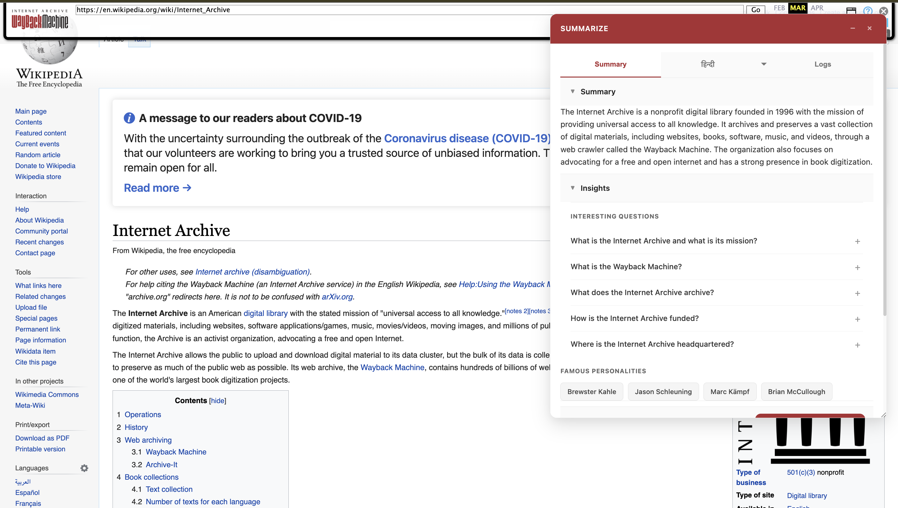
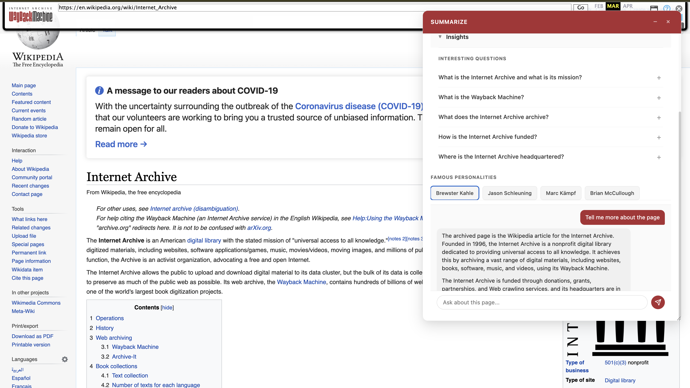
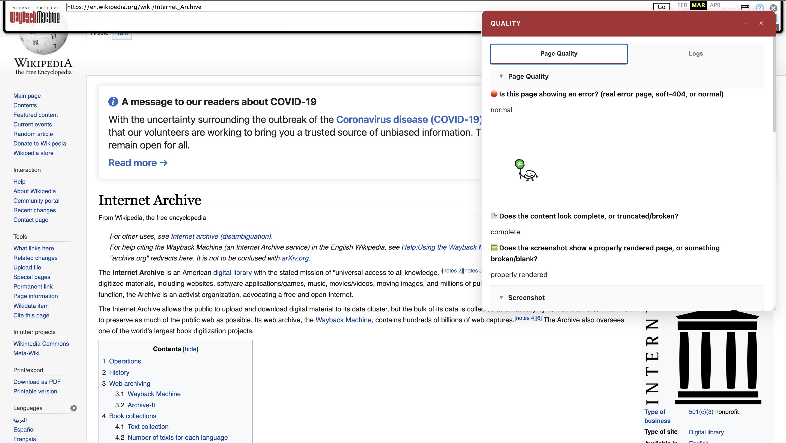
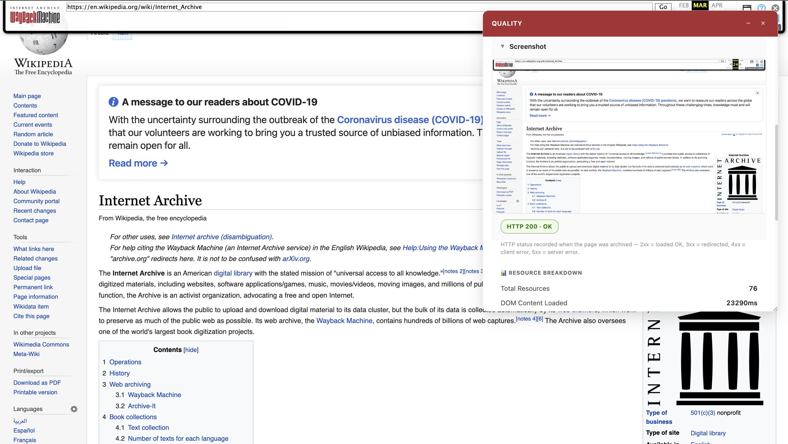
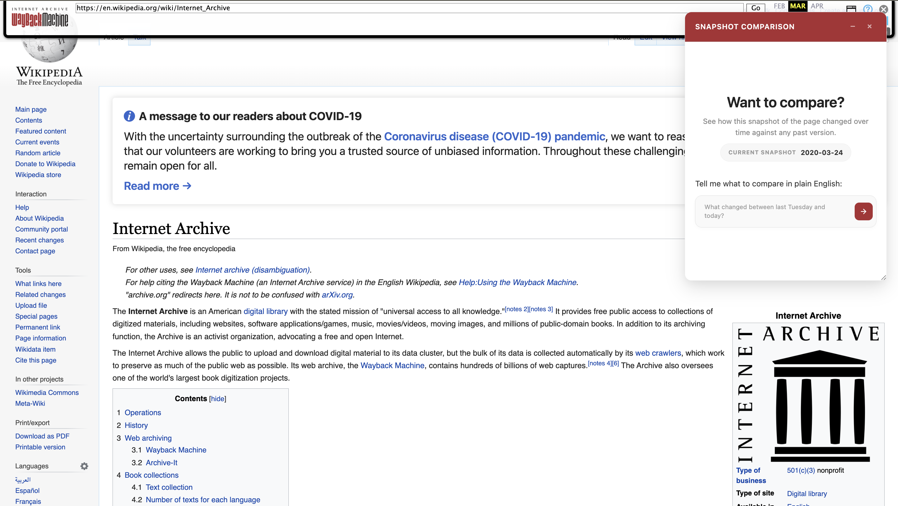
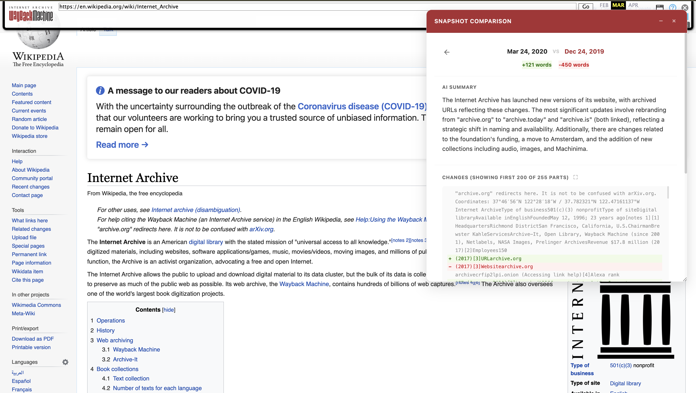
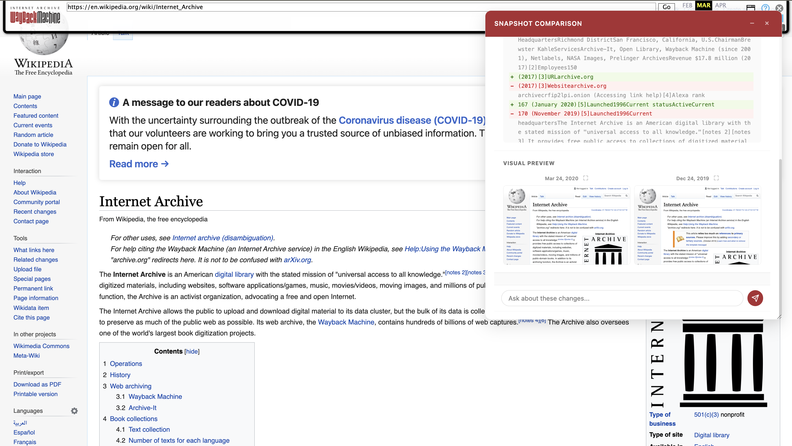
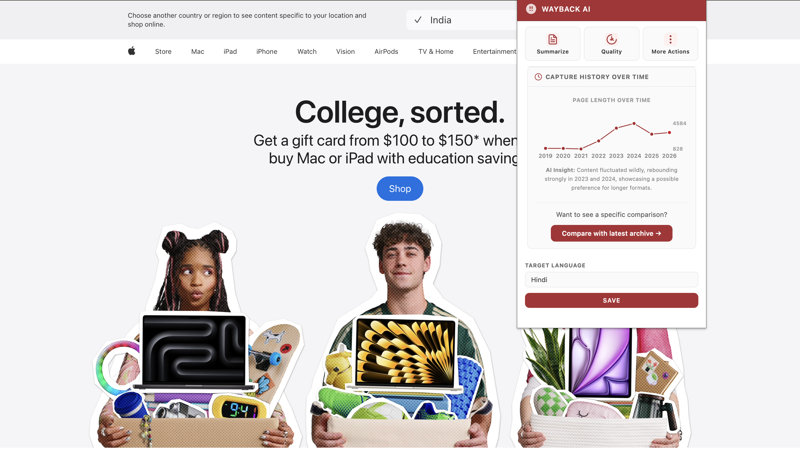
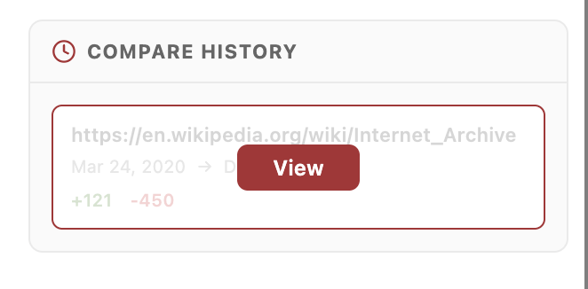

# Wayback Machine AI Assistant

**Understand archived web pages with AI — entirely on your device.**

The Wayback Machine AI Assistant is a Chrome extension that helps you explore [Internet Archive](https://web.archive.org) captures. Summarize old pages, check whether a capture looks complete, compare how a site changed over time, and ask follow-up questions, all powered by Chrome’s built-in Gemini Nano model. Your page content stays on your machine; nothing is sent to external AI services.

> A [Google Summer of Code 2026](https://summerofcode.withgoogle.com/) project with the [Internet Archive](https://archive.org).

---

## Watch it in action

---

## What you can do

### Summarize




Get a short AI summary of an archived page, plus structured insights (FAQs, notable people). Ask follow-up questions using the chat input below the results.

### Quality




See whether a snapshot loaded properly — HTTP status, load timings, screenshot analysis, and an AI verdict on completeness or errors.

### Compare Snapshots





Diff two archived versions of the same page side by side, with an AI summary of what changed and a chat to explore the differences.

### Live Compare



On any live website, compare the current page against its most recent Wayback Machine capture.

### Capture History



From the toolbar popup, view how often a URL was archived, a timeline of HTTP status codes, and how page length evolved over the years.


---

## Requirements

Before installing, make sure you have:

1. **Google Chrome** (desktop) with **built-in AI (Gemini Nano)** enabled and ready.
  - AI features only work when Chrome reports the on-device model as **available**.
  - If the model is still downloading or unsupported, Summarize and Quality will show a friendly message; some Compare features (the diff itself) still work without AI.
2. **An internet connection** — the extension reads pages from [web.archive.org](https://web.archive.org) and uses the Wayback CDX API. No separate API keys are needed.
3. **A Wayback playback page** for most features, URLs that look like:
  ```
   https://web.archive.org/web/20200101120000/https://example.com/
  ```

---

## Install the extension

There is no build step, npm install, or API key setup. Just load the folder into Chrome:

1. **Clone this repository**
  ```bash
   git clone https://github.com/internetarchive/wbm_client_side_ai_extension.git
   cd wbm_client_side_ai_extension
  ```
2. Open Chrome and go to `chrome://extensions`
3. Turn on **Developer mode** (top-right toggle)
4. Click **Load unpacked** and select the project folder
5. Pin the extension from the puzzle icon in the toolbar, you’re ready to go.

---

## How to use it

### On an archived page

Visit any snapshot on [web.archive.org](https://web.archive.org), then use either entry point:

**Right-click the page** → **Wayback Machine AI Helper**

- Summarize Page
- Check page quality
- Compare Snapshots

**Click the extension icon** in the toolbar

- **Summarize** or **Quality** — run the feature on the current snapshot
- **More Actions** → **Compare Snapshots** or **Compare History** (reopen past comparisons)
- **Capture History Over Time** — see archive stats and a monthly timeline for the current URL

Results open in a **resizable overlay** in the top-right corner of the page.

### On a live website

Open the toolbar popup on any non-archive page. When capture history is available, use **Compare with latest archive →** to diff the live page against its most recent snapshot.

### Compare Snapshots workflow

1. Trigger **Compare Snapshots** from the context menu or popup.
2. Describe what you want to compare in plain language, e.g. *“compare with the oldest version”* or *“compare January 2020 vs March 2022”*.
3. Review the word-level diff, AI change summary, side-by-side previews, and optional comparison chat.

### Summarize workflow

1. Trigger **Summarize** on an archived page.
2. Read the streaming summary and structured insights (FAQs, notable people).
3. Use the chat input below the results to ask follow-up questions about the page content.

---

## Settings

Open the toolbar popup and choose a **Target Language** from the dropdown:

English · Spanish · French · German · Japanese · Chinese · Hindi · Portuguese · Russian · Italian

Click **Save**. Summaries and insights can then be translated on-device into your chosen language. Quality checks are always shown in English.

---

## Privacy

- **AI runs locally** using Chrome’s built-in Prompt, Translator, and Language Detector APIs (Gemini Nano).
- **No external LLM API keys** — you do not configure or send data to OpenAI, Google Cloud, or similar services.
- **Network requests** go only to `web.archive.org` (playback pages, CDX API, and snapshot HTML for comparisons).
- **Caching** — results are stored locally in your browser for up to 24 hours to speed up repeat visits.

---

## Tips & limitations

- **Chrome only** — the extension relies on Chrome’s built-in AI APIs and is not tested on Firefox, Safari, or Edge.
- **Playback URLs required** — Summarize, Quality, and archive-mode Compare need a specific snapshot URL (`/web/{timestamp}/{url}`), not the Wayback calendar or search results page.
- **Visible tab for screenshots** — the Quality feature captures a screenshot only when the tab is in the foreground.
- **Short pages** — pages with very little extractable text (< 100 characters) cannot be summarized.
- **Quality is always fresh** — unlike summaries, quality results are not cached so each check reflects the current render.

---

## For developers & contributors

Detailed technical documentation lives in the `[docs/](docs/)` folder:


| Doc                                          | Description                                      |
| -------------------------------------------- | ------------------------------------------------ |
| [Architecture](docs/ARCHITECTURE.md)         | MV3 runtime contexts, messaging, overlay pattern |
| [Summarize](docs/SUMMARY.md)                 | End-to-end summarize, translation, and chat flow |
| [Quality](docs/QUALITY.md)                   | Timings, screenshots, CDX status, AI verdict     |
| [Comparison](docs/COMPARISON.md)             | Diff engine, AI summaries, live compare, chat    |
| [AI Sessions](docs/AI_SESSIONS.md)           | Gemini Nano session management and streaming     |
| [Message Protocol](docs/MESSAGE_PROTOCOL.md) | Runtime message reference                        |
| [Caching](docs/CACHING.md)                   | Local storage design and eviction                |


**GSoC progress & blog**

- [Development log (Notion)](https://www.notion.so/GSoC-2026-Internet-Archive-366417d0f1468091ad29cf698b03cff2)
- [Hashnode blog](https://sudiptadas.hashnode.dev)

---

## License

This project is licensed under the [GNU Affero General Public License v3.0](LICENSE).
